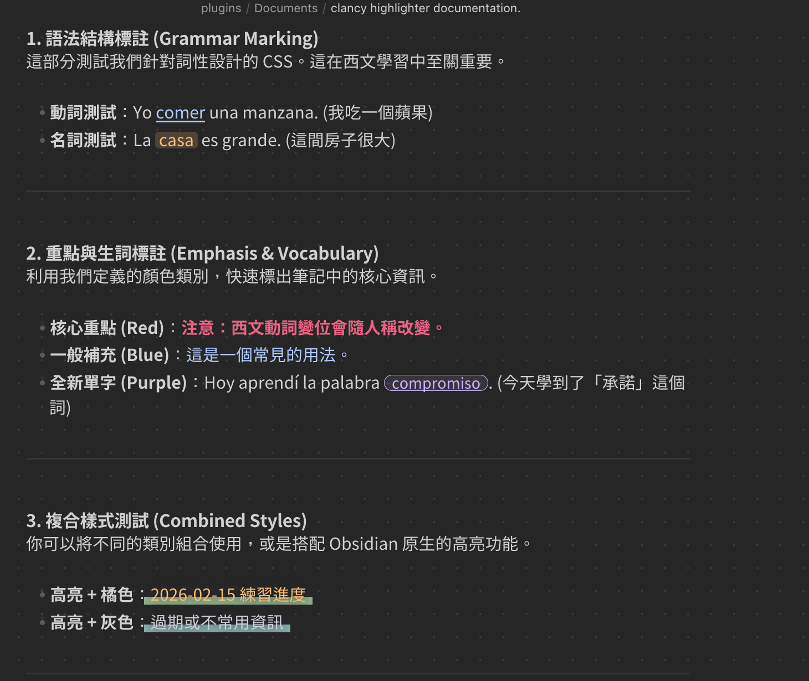
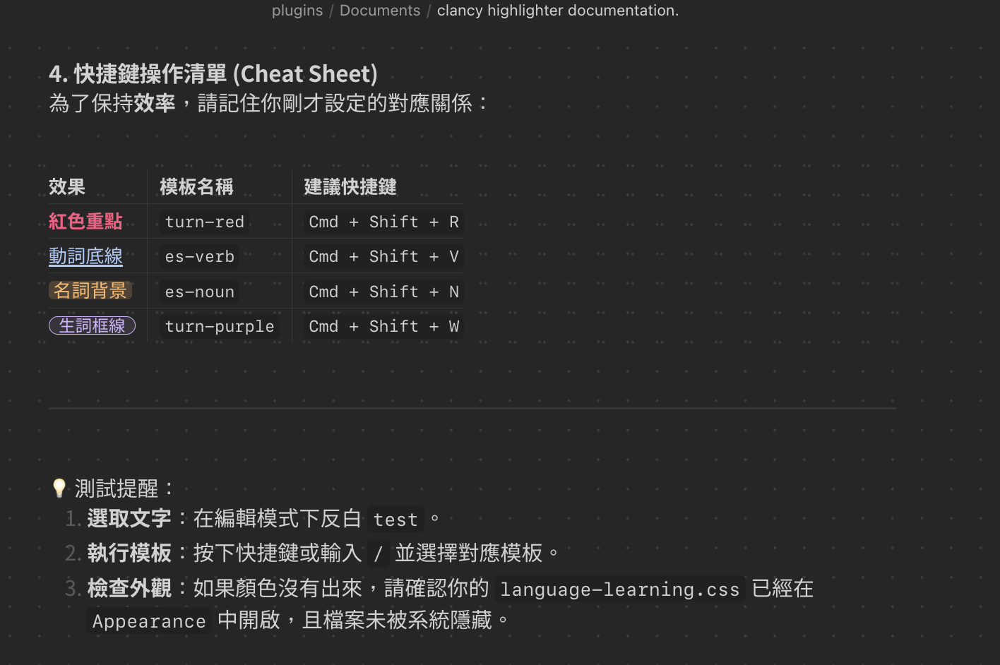
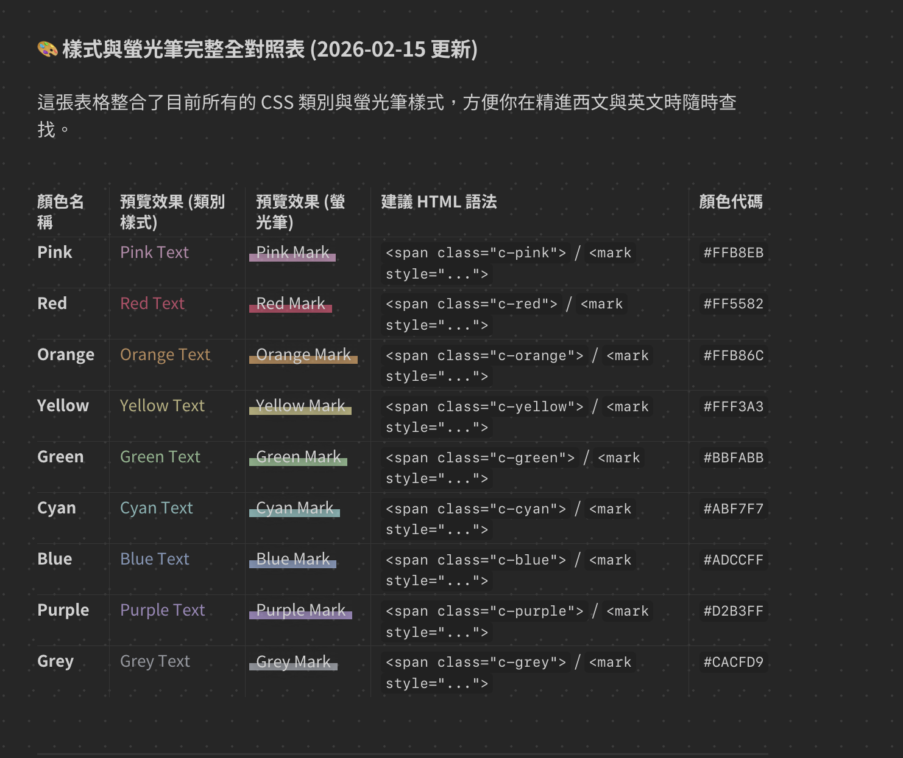
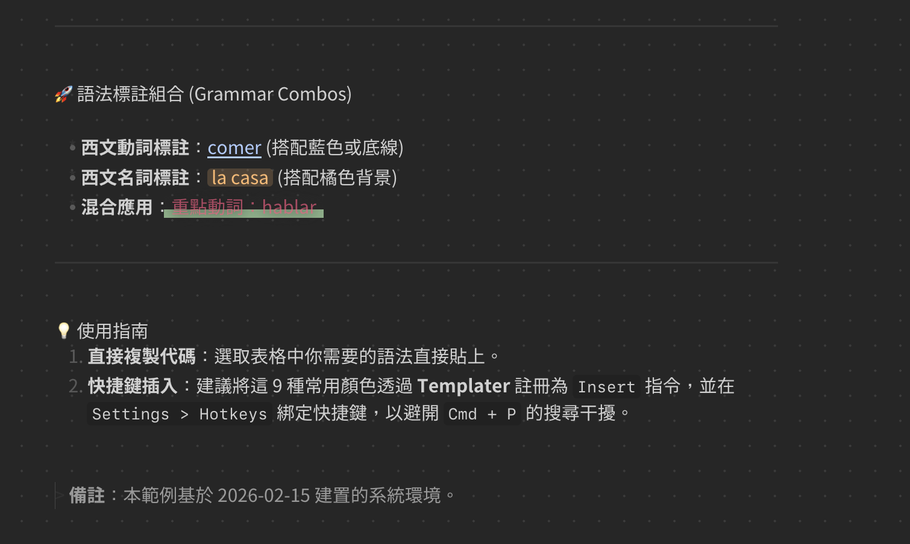

# clancy-color-preset 🎨

A minimalist Obsidian configuration preset optimized for language learning, systems thinking, and structured note-taking.

---

## 📸 Previews

## 🖥️ Environment
* **Base Theme**: [Minimal Theme](https://github.com/kepano/obsidian-minimal)
* **Minimal Skin**: Official Minimal Skin preset
* **Primary Font**: Taipei Sans TC (Taipei Black)
* **Display Mode**: Optimized for Dark Mode

## 🛠️ Core Plugins
This preset works in tandem with the following plugins for automated visual marking:
1. **[Highlighter](https://github.com/sytten/obsidian-highlighter)**: Rapid fluorescent color marking.
2. **[Templater](https://github.com/SilentVoid13/Templater)**: One-click insertion of HTML/CSS tags.

## 🎨 Color & Grammar System
| Category | Usage | CSS Class |
| :--- | :--- | :--- |
| **Red** | Key points & Error corrections | `.c-red` |
| **Purple** | New vocabulary (Word New) | `.word-new` |
| **Verb Style** | Grammar: Conjugations (Underline) | `.grammar-verb` |
| **Noun Style** | Grammar: Noun Genders (Background) | `.grammar-noun` |

## ✍️ Feature: Dot Grid
A subtle dot grid (25px x 25px) provides horizontal reference lines, mimicking physical graph paper for better layout control.

## 🚀 Terminal Workflow
Recommended aliases for efficiency:
* `obcss`: Open the snippets folder with Sublime Text.
* `gocss`: One-click sync to GitHub.

---
---

# 繁體中文說明

這是一個專為 Obsidian 設計的個人化設定檔，特別針對語言學習（英文與西文）、系統思考以及高效筆記進行了優化。

## 🖥️ 環境配置
* **基礎佈景**: Minimal Theme
* **主要字體**: 台北黑體 (Taipei Sans TC)
* **顯示模式**: 深色模式優化

## 🛠️ 核心外掛
1. **Highlighter**: 用於快速標註螢光筆色彩，已與 CSS 代碼同步色碼。
2. **Templater**: 用於一鍵插入標籤，避開手動輸入的繁瑣。

## 🎨 顏色與語法標註
* **紅色**: 核心重點、錯誤更正。
* **紫色**: 新單字標註。
* **動詞標註**: 適用於西文動詞變位（底線樣式）。
* **名詞標註**: 適用於名詞陰陽性（背景色樣式）。

## ✍️ 特色：點狀網格
背景加入了一層淡淡的點狀網格，提供書寫時的水平參考，讓排版更具備方格紙的視覺感。

## 📝 授權與使用
此設定檔由 Clancy 開發，旨在提供一個更具邏輯性的語言學習環境。歡迎參考或根據個人需求進行修改。